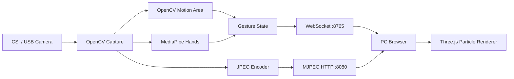

# PiGesture Nebula

基于树莓派视觉手势识别的三维粒子交互系统。

本项目使用树莓派摄像头采集手部画面，在树莓派端运行 OpenCV 与低频 MediaPipe Hands，通过 WebSocket 向电脑网页发送控制数据，同时通过 HTTP MJPEG 推送实时摄像头画面。网页端使用 Three.js 渲染三维粒子模型，并支持运动面积、指尖捏合与混合模式控制。

> 课程设计题目：基于树莓派视觉手势的三维粒子模型交互系统

## 项目特点

- 树莓派 CSI / USB 摄像头采集
- OpenCV 帧差与最大运动面积检测
- MediaPipe Hands 21 点手部骨架识别
- 拇指与食指指尖距离控制粒子模型缩放
- WebSocket 实时传输 `scale / area / motion / landmarks`
- HTTP MJPEG 摄像头背景流
- Three.js 粒子星球、透明线框和呼吸动画
- Browser / Raspberry / Simulate 三种输入模式
- Area / Pinch / Hybrid 三种控制模式
- CSV 性能记录、重复实验聚合和性能曲线输出

## 系统架构



系统采用双通道通信：

```text
控制流：摄像头 -> OpenCV / MediaPipe -> WebSocket -> Three.js
视觉流：摄像头 -> JPEG -> HTTP MJPEG -> 浏览器背景
```

树莓派只负责图像采集、特征提取和参数发送，三维渲染由电脑浏览器完成。

## 控制模式

### Area

OpenCV 每帧计算最大运动区域面积，并映射为模型缩放比例。该模式负载低、响应稳定，是默认演示模式。

### Pinch

MediaPipe Hands 获取 21 个手部关键点，使用拇指指尖 `landmark 4` 与食指指尖 `landmark 8` 的距离控制模型缩放。

```text
指尖靠近 -> 粒子模型缩小
指尖分开 -> 粒子模型放大
```

### Hybrid

MediaPipe 检测到手部时使用 Pinch 控制；暂时未检测到手部时自动回退到 OpenCV Area 控制。

## 推荐运行配置

最终演示以 CSI 摄像头为主：

```text
分辨率：320x240
目标帧率：30 FPS
JPEG 质量：70
单手识别：max_num_hands=1
MediaPipe 增强模式：infer_skip=10
```

性能实验表明，OpenCV 适合作为实时主链路，MediaPipe 适合作为低频语义增强层。

| 配置 | 主循环 / MJPEG FPS | 骨架 FPS | 平均循环耗时 |
|---|---:|---:|---:|
| OpenCV Area | 28.97 | 0 | 16.27 ms |
| Hybrid skip15 | 22.25 | 1.49 | 26.78 ms |
| Hybrid skip10 | 19.24 | 1.92 | 33.16 ms |
| Hybrid skip5 | 13.12 | 2.60 | 55.91 ms |
| Hybrid skip3 | 9.73 | 3.23 | 83.42 ms |
| Hybrid skip1 | 4.06 | 4.06 | 239.92 ms |

因此本项目选定：

```text
默认演示：OpenCV Area + MJPEG70
增强演示：Hybrid + infer_skip=10 + MJPEG70
```

详细实验结果见 [PERFORMANCE_EXPERIMENT.md](./PERFORMANCE_EXPERIMENT.md) 与 [`perf_report`](./perf_report)。

## 项目结构

```text
.
├── index.html                         # Three.js 页面与交互逻辑
├── raspberry_gesture_server.py        # WebSocket + MJPEG + 手势识别服务
├── raspberry_perf_benchmark.py        # 树莓派性能测试程序
├── analyze_perf_results.py            # CSV 聚合与性能曲线生成
├── raspberry_ws_mock.py               # 本地 WebSocket 模拟数据
├── run_perf_suite_csi.sh              # CSI 基础测试矩阵
├── run_perf_suite_csi_30fps_matrix.sh # CSI 30 FPS / infer_skip 测试
├── run_perf_suite_usb.sh              # USB 摄像头对照测试
├── RASPBERRY_SETUP.md                 # 树莓派部署说明
├── PERFORMANCE_EXPERIMENT.md           # 性能实验设计
├── TEST_DAY_CHECKLIST.md               # 测试日检查清单
├── perf_results_csi/                   # CSI 原始实验数据
├── perf_results_usb/                   # USB 对照实验数据
└── perf_report/                        # 聚合表与性能曲线
```

## 环境要求

### 树莓派端

- Raspberry Pi 3 Model B+ 或更高
- Raspberry Pi OS / Raspbian
- CSI 摄像头或 V4L2 USB 摄像头
- Python 3
- OpenCV
- MediaPipe Hands 兼容包
- psutil（性能记录可选）

本项目测试环境为 Raspberry Pi 3B+、Raspbian GNU/Linux 10、Python 3.7 与旧版 Camera Stack。

### 网页端

- 支持 WebGL 的现代浏览器
- Three.js
- MediaPipe Hands Web 版本（Browser 模式）
- 与树莓派处于同一局域网

## 快速开始

### 1. 上传树莓派服务端

在 Windows PowerShell 中执行：

```powershell
scp .\raspberry_gesture_server.py pi@<PI_IP>:/home/pi/
```

### 2. 准备 CSI 摄像头

```bash
sudo modprobe bcm2835-v4l2
ls -l /dev/video0
```

### 3. 启动默认 OpenCV 模式

```bash
python3 /home/pi/raspberry_gesture_server.py \
  --camera 0 \
  --mode opencv \
  --width 320 \
  --height 240 \
  --fps 30 \
  --jpeg-quality 70 \
  --no-preview
```

### 4. 启动 Hybrid 增强模式

```bash
python3 /home/pi/raspberry_gesture_server.py \
  --camera 0 \
  --mode hybrid \
  --width 320 \
  --height 240 \
  --fps 30 \
  --infer-skip 10 \
  --model-complexity 0 \
  --max-num-hands 1 \
  --jpeg-quality 70 \
  --no-preview
```

### 5. 启动网页

在项目目录运行：

```powershell
python -m http.server 8000
```

浏览器打开：

```text
http://localhost:8000/
```

选择 `Raspberry`，填写：

```text
WebSocket: ws://<PI_IP>:8765
MJPEG:    http://<PI_IP>:8080/video
```

点击 `Connect`，然后选择 `Area`、`Pinch` 或 `Hybrid` 控制模式。

## Browser 与 Simulate 模式

### Browser

使用电脑摄像头与浏览器端 MediaPipe Hands，适合在没有树莓派时调试 Three.js 和手势映射。

### Simulate

使用本地模拟数据测试粒子模型缩放，不启用摄像头和 MediaPipe。

## 性能测试

运行 CSI 30 FPS 测试矩阵：

```bash
chmod +x /home/pi/run_perf_suite_csi_30fps_matrix.sh
/home/pi/run_perf_suite_csi_30fps_matrix.sh
```

在电脑端生成汇总和曲线：

```powershell
python .\analyze_perf_results.py .\perf_results_csi --out-dir .\perf_report
```

主要输出：

```text
performance_summary.csv
performance_summary.md
skip_summary.csv
skip_vs_fps.png
skip_vs_loop.png
skip_vs_temp_cpu.png
```

## 后续计划

- 加载 STL / GLB 模型并进行表面粒子采样
- 支持粒子球、心形和自定义模型之间的形态切换
- 使用拇指与食指关键点识别比心或捏合触发动作
- 增加粒子爆发、聚合、颜色变化和轨迹效果
- 增加旋转、移动和多手势组合控制
- 整理演示视频、运行截图和课程设计报告

## 项目来源与致谢

本项目参考并改造自：

- [collidingScopes/threejs-handtracking-101](https://github.com/collidingScopes/threejs-handtracking-101)
- [Three.js](https://threejs.org/)
- [MediaPipe Hands](https://ai.google.dev/edge/mediapipe/solutions/vision/hand_landmarker)

原项目提供了浏览器摄像头、MediaPipe Hands 与 Three.js 三维球体交互的基础思路。本项目在此基础上增加了树莓派端视觉处理、WebSocket 控制流、MJPEG 视频流、双模式手势识别、粒子渲染和性能实验框架。

## License

原参考项目声明使用 MIT License。上传公开仓库前，建议在仓库根目录补充 `LICENSE` 文件，并保留原项目作者与来源说明。
